# shape-reconstruction

Shape reconstruction from RGBD images from ShapeNet dataset.

## Milestone X+2 - 26.05.2023
1. Created a draft of a report: see overleaf
2. Generated animations

| Animations | Category |
|------------|----------|
 |            |          |
## Milestone X+1 - 19.05.2023

1. Voxel scaling methods and their results are in the `src/voxel_grid_scaling.ipynb` notebook.
2. We created the following dataset: sampled 50% of the already possessed voxel grids of size 32. Moreover, we took 21
   small categories from the original ShapeNet, downsampled voxel grids from 128 to 32.
3. We trained the model on the dataset from point 2.
4. For the best model:

| Prediction vs ground truth                                                                                             | IOU @ [0.2, 0.3, 0.4, 0.5]                                                                                |
   |------------------------------------------------------------------------------------------------------------------------|-----------------------------------------------------------------------------------------------------------|
   | 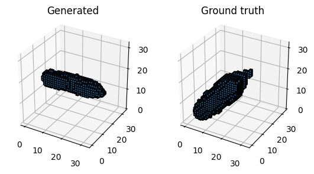 | [0.0, 0.0, 0.0, 0.0]                                                                                      |
   | 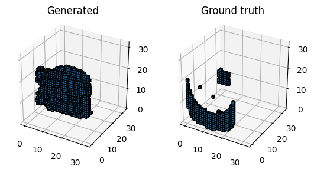 | [0.006169031374156475, 0.0024671051651239395, 0.0007207207381725311, 0.0004868549294769764]               |
   | 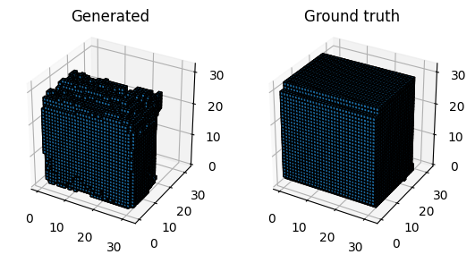 | [0.788195788860321, 0.7476620078086853, 0.6822559237480164, 0.6127283573150635]                           |
   | 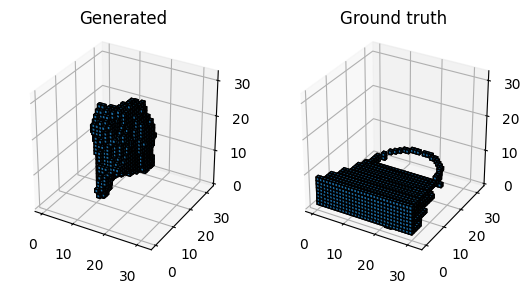 | [0.05392912030220032, 0.03249683976173401, 0.0163899976760149, 0.009334315545856953]                      |
   | 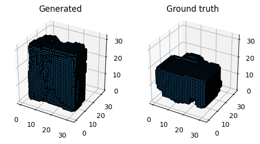 | [0.3507832884788513, 0.3627062737941742, 0.3700735867023468, 0.3858749568462372]                          |
| 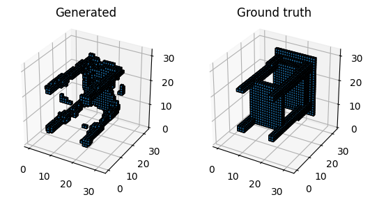 | [0.45544764399528503, 0.4681413769721985, 0.4616822302341461, 0.3465259373188019]     (shared with train) |

## Milestone X - 12.05.2023

| Prediction vs ground truth                                                                                      | IOU @ [0.2, 0.3, 0.4, 0.5]                                                                                    |
|-----------------------------------------------------------------------------------------------------------------|---------------------------------------------------------------------------------------------------------------|
| 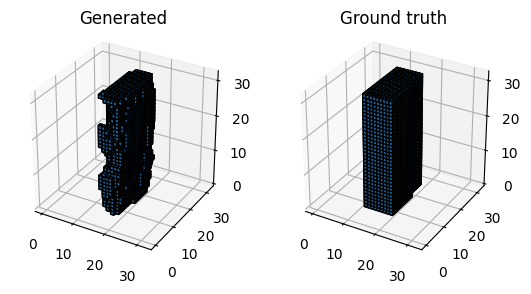 | [0.662952184677124, 0.678329348564148, 0.670099139213562, 0.6430394649505615]                                 |
| 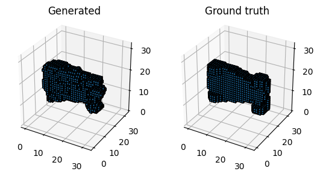 | [0.7360618710517883, 0.7447314858436584, 0.7390680909156799, 0.7052906155586243] (category shared with train) |
| 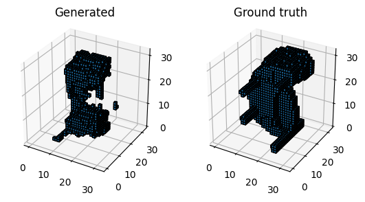 | [0.2536977529525757, 0.2402084320783615, 0.2236427366733551, 0.1977536380290985]                              |
| 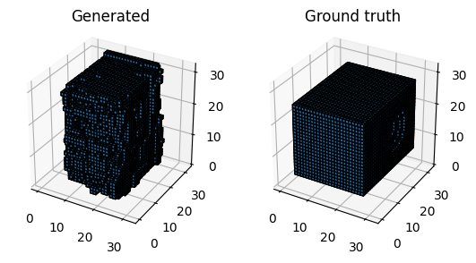 | [0.5040155053138733, 0.49083250761032104, 0.4773334562778473, 0.4625006318092346]                             |

## Milestone 2 - 28.04.2023

### Literature / useful sources:

- [POCO](https://github.com/valeoai/poco)
- [3D Reconstruction of Novel Object Shapes from Single Images](https://github.com/rehg-lab/3dshapegen)
- [3D Reconstruction from RGB-D](https://openaccess.thecvf.com/content_ICCV_2017_workshops/papers/w13/Yang_3D_Object_Reconstruction_ICCV_2017_paper.pdf)
- [Papers with code](https://paperswithcode.com/task/single-view-3d-reconstruction)
- [Large-Scale 3D Shape Reconstruction and Segmentation from ShapeNet Core55](https://arxiv.org/pdf/1710.06104.pdf)

## Milestone 1 - 21.04.2023

Activities performed:

- implementation of ShapeNet sampling script (`scripts/sample_shapenet.py`)
- implementation of RenderBlender(TM) - a script parsing meshes into RGB and depth images (`scripts/render_blender.py`)
- preprocessing of the sampled pared of the dataset (10%)

| RGB                            | DEPTH                              |
|--------------------------------|------------------------------------|
| 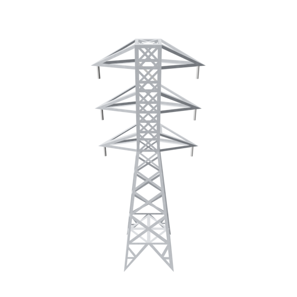 | 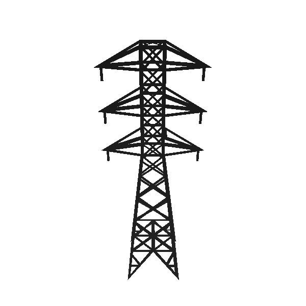 |
